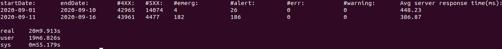

*<h3> Intro: </h3>*
HAProxy sits in the critical path of your infrastructure. Whether used as an edge load balancer, a sidecar, or as a Kubernetes ingress controller, getting meaningful logs out of HAProxy is a must-have.
Logging gives you insights about each connection and request. It enables observability needed for troubleshooting and can even be used to detect problems early. It’s one of the many ways to get information from HAProxy.
HAProxy logs include:
Metrics about the traffic: timing data, connections counters, traffic size, etc.
Information about HAProxy decisions: content switching, filtering, persistence, etc.
Information about requests and responses: headers, status codes, payloads, etc.
Termination status of a session and the ability to track where failures are occurring

*<h3> HAProxy Log Format: </h3>*
The type of logging you’ll see is determined by the proxy mode that you set within HAProxy. HAProxy can operate either as a Layer 4 (TCP) proxy or as Layer 7 (HTTP) proxy. TCP mode is the default. In this mode, a full-duplex connection is established between clients and servers, and no layer 7 examination will be performed


And in this assignment the logs in log files were mixed with both layer 4 and layer 7 log formats 

Also HAProxy provides **severity** levels in the same way that syslog provides these in system logs which can be seen below:


Furthermore **service times** are provided in HAProxy logs so it is possible to calculate average server response time

this project is mainly based on the functionality of **"grep"** commands & subcommands to take out HTTP status & timers and log levels and it is precieved that HAProxy logs are provided in zip files in the same directory

<h3>steps to run the script:</h3>
In order to run the script make sure that you put all the zipped haproxy log files in the same directory of the script then:

```
chmod +x script.sh
./script.sh
```

A sample output of this script :

